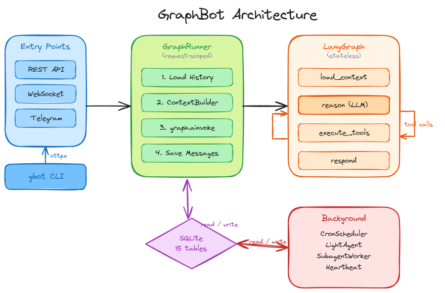

# GraphBot

Extensible AI assistant framework built on LangGraph.

Multi-channel support, long-term memory, background tasks, tool system, and an interactive CLI — all backed by SQLite as the single source of truth.

## What is this project for?

GraphBot is designed to help you build a **production-ready personal/team assistant** that can move beyond plain chat:

- Persist conversation state and user memory in a simple local database (SQLite)
- Run tool-augmented workflows (files, shell, web, reminders, cron jobs, delegation)
- Serve users through API, CLI, WebSocket, and messaging channels from one core runtime
- Keep the agent loop stateless while maintaining durable operational history and tasks

In short: this project aims to be a practical assistant platform you can run, extend, and operate without heavyweight infrastructure.

## Quick Start

**Prerequisites:** Python 3.11+, [uv](https://docs.astral.sh/uv/)

### 1. Install

```bash
git clone https://github.com/omrylcn/gbot.git
cd gbot
uv sync --extra dev
```

### 2. Configure

```bash
cp config.example.yaml config.yaml   # your local config (gitignored)
cp .env.example .env                 # your API keys (gitignored)
```

Edit `.env` — you need at least one LLM provider:
```bash
OPENROUTER_API_KEY=sk-or-...    # recommended (access to many models)
# or: OPENAI_API_KEY=sk-...
# or: ANTHROPIC_API_KEY=sk-...
```

Edit `config.yaml` — set your owner info and preferred model:
```yaml
assistant:
  name: "GraphBot"
  owner:
    username: "yourname"
    name: "Your Name"
  model: "openrouter/google/gemini-2.5-flash"   # or openai/gpt-4o-mini, etc.
```

### 3. Run

```bash
gbot run                    # start API server on :8000
gbot                        # open interactive REPL
```

That's it. The REPL connects to the API server automatically.

---

## Architecture



GraphBot deliberately separates the "thinking" from the "remembering." LangGraph handles the agent loop as a pure execution engine — no checkpoints, no internal state. All durable state lives in SQLite: sessions, memory, users, scheduled tasks, events. This means you can restart the server, swap models, or scale horizontally without losing anything.

| Principle | Description |
|-----------|-------------|
| **LangGraph = stateless** | No checkpoint — used purely as an execution engine |
| **SQLite = source of truth** | 15 tables for sessions, memory, users, tasks, events |
| **GraphRunner = orchestrator** | Request-scoped bridge between SQLite and LangGraph |
| **LiteLLM = multi-provider** | OpenAI, Anthropic, DeepSeek, Groq, Gemini, OpenRouter |

The agent graph has 4 nodes: `load_context` → `reason` ⇄ `execute_tools` → `respond`

---

## Features

GraphBot isn't just a chatbot wrapper — it's a full operational platform. Here's what's built in and working:

| Feature | Description |
|---------|-------------|
| Multi-provider LLM | 6+ providers via LiteLLM + direct OpenRouter SDK |
| Multi-channel | Telegram (active), WhatsApp via WAHA (active), Discord/Feishu (stub) |
| Long-term memory | Notes, preferences, favorites, activity logs in SQLite |
| Session management | Token-limit based with automatic LLM summary on transition |
| RBAC | 3 roles (owner/member/guest), roles.yaml, 2-layer guard |
| 7 tool groups | Memory, search, filesystem, shell, web, messaging, delegation |
| Skill system | Markdown-based, workspace override, always-on support |
| Background tasks | Cron scheduler, one-shot reminders, heartbeat, async subagents |
| Delegation | LLM-based planner — immediate, delayed, recurring, monitor |
| Interactive CLI | `gbot` — Rich REPL with slash commands and autocomplete |
| Admin API | Server status, config, skills, tools, users, stats, cron, logs |
| RAG | Optional FAISS + sentence-transformers semantic search |
| WebSocket | Real-time chat + event delivery |
| Docker | Single-command deployment with docker-compose |

Most of these work together. For example, a user on Telegram can say "remind me every morning at 9 to check gold prices" — the delegation planner creates a recurring cron job, the LightAgent runs it with web tools, and the result gets delivered back through Telegram. No manual wiring needed.

---

## Usage

GraphBot gives you three ways to interact: a CLI for quick operations, a REPL for interactive sessions, and a REST API for integration. They all talk to the same backend — pick whichever fits your workflow.

### CLI Commands

```bash
gbot                                     # interactive REPL (default)
gbot run [--port 8000] [--reload]        # API server
gbot chat -m "hello"                     # single message via API
gbot chat --local -m "hello"             # local mode (no server needed)
gbot status                              # system info
gbot --version                           # version
```

User management:
```bash
gbot user add ali --name "Ali" --password "pass123" --telegram "BOT_TOKEN"
gbot user list
gbot user remove ali
gbot user set-password ali newpass
gbot user link ali telegram 12345
```

Credentials:
```bash
gbot login ali -s http://localhost:8000  # saves token to ~/.graphbot/
gbot logout
```

Cron jobs:
```bash
gbot cron list
gbot cron remove <job_id>
```

### REPL Slash Commands

Type `/` inside the REPL for autocomplete:

| Command | Description |
|---------|-------------|
| `/help` | Command list |
| `/status` | Server status |
| `/session info\|new\|list\|end` | Session management |
| `/history [n]` | Last n messages |
| `/context` | User context |
| `/model` | Active model |
| `/config` | Server configuration |
| `/skill` | Skill list |
| `/cron list\|remove <id>` | Cron management |
| `/user` | User list |
| `/events` | Pending events |
| `/clear` | Clear screen |
| `/exit` | Exit |

### REST API

| Method | Path | Description |
|--------|------|-------------|
| POST | `/chat` | Send message, get response |
| GET | `/health` | Health check |
| GET | `/sessions/{user_id}` | User's sessions |
| GET | `/session/{sid}/history` | Session message history |
| GET | `/session/{sid}/stats` | Session stats (messages, tokens, context) |
| POST | `/session/{sid}/end` | End session |
| GET | `/user/{user_id}/context` | User context |
| POST | `/auth/register` | Register (owner-only) |
| POST | `/auth/login` | Login |
| POST | `/auth/token` | OAuth2 token endpoint |
| GET | `/auth/user/{user_id}` | User profile |
| POST | `/auth/api-keys` | Create API key |
| GET | `/auth/api-keys` | List API keys |
| DELETE | `/auth/api-keys/{key_id}` | Deactivate API key |
| WS | `/ws/chat` | WebSocket chat + event delivery |
| POST | `/webhooks/telegram/{user_id}` | Telegram webhook |
| POST | `/webhooks/whatsapp/{user_id}` | WhatsApp webhook (WAHA) |

### Admin Endpoints (owner-only)

| Method | Path | Description |
|--------|------|-------------|
| GET | `/admin/status` | Server status |
| GET | `/admin/config` | Sanitized configuration |
| GET | `/admin/skills` | Skill list |
| GET | `/admin/tools` | Registered tools (ToolRegistry introspection) |
| GET | `/admin/users` | User list |
| PUT | `/admin/users/{user_id}/role` | Set user role |
| GET | `/admin/crons` | Cron job list |
| DELETE | `/admin/crons/{job_id}` | Delete cron job |
| GET | `/admin/stats` | System stats (context, tools, sessions, data) |
| GET | `/admin/logs` | Delegation logs |

### Tool Usage (via Chat)

You don't call tools by name — just describe what you want. The LLM figures out which tool to use:

```
"Save this note: meeting tomorrow"                   → save_user_note
"Set a reminder in 5 minutes: take medicine"          → create_reminder
"Check the weather every morning at 9"                → add_cron_job
"Alert me if gold goes above $2000"                   → create_alert
"Do this in the background: research topic X"         → delegate
```

---

## Configuration

GraphBot uses a layered config system — you can set things in multiple places, and the most specific one wins:

Priority order: `.env` > environment variables > `config.yaml` > defaults

```bash
# .env uses GRAPHBOT_ prefix with __ separator
GRAPHBOT_ASSISTANT__MODEL=openai/gpt-4o-mini
GRAPHBOT_PROVIDERS__OPENAI__API_KEY=sk-...
GRAPHBOT_BACKGROUND__CRON__ENABLED=true
```

Full config reference: [`config.example.yaml`](./config.example.yaml)

### Authentication

Authentication is optional — you can run GraphBot wide open for local development, or lock it down with JWT + API keys for production. A single config value controls the switch:

#### Auth Disabled (default)

The `auth.jwt_secret_key` field in `config.yaml` controls authentication. By default it is empty (`""`), which means auth is disabled — all endpoints are open and `user_id` is passed in the request body:

```yaml
# config.yaml (default)
auth:
  jwt_secret_key: ""    # empty = auth disabled
```

```bash
curl -X POST http://localhost:8000/chat \
  -H "Content-Type: application/json" \
  -d '{"message": "hello", "user_id": "ali"}'
```

#### Auth Enabled

Set `jwt_secret_key` to a 32+ character secret to enable JWT authentication:

```yaml
# config.yaml
auth:
  jwt_secret_key: "your-secret-key-at-least-32-characters"
  access_token_expire_minutes: 1440   # 24 hours (default)
```

Or via `.env`:
```bash
GRAPHBOT_AUTH__JWT_SECRET_KEY=your-secret-key-at-least-32-characters
```

| State | `auth.jwt_secret_key` | Access |
|-------|----------------------|--------|
| Auth disabled | `""` (empty, default) | Open — `user_id` in request body |
| Auth enabled | `"your-secret..."` | JWT token or API key required |

#### User Management

Users are managed via the `gbot` CLI, which writes directly to the SQLite database. This is the **primary way** to create users — no running server or authentication needed:

```bash
# Create user with password
gbot user add ali --name "Ali" --password "pass123"

# Create user + link Telegram bot in one command
gbot user add ali --name "Ali" --password "pass123" --telegram "BOT_TOKEN"

# Change password
gbot user set-password ali newpass

# Link a channel to an existing user
gbot user link ali telegram 12345

# List all users
gbot user list

# Remove user
gbot user remove ali
```

> **Important:** When auth is enabled, users must exist in the database before they can login. The `owner` defined in `config.yaml` is auto-created at server startup, but all other users must be added via CLI first.

#### Login & Token Flow

Once a user exists, they can authenticate:

**CLI login** — saves token to `~/.graphbot/credentials.json`:

```bash
gbot login ali -s http://localhost:8000   # prompts for password
gbot                                       # uses saved token automatically
gbot logout                                # clears saved credentials
```

**API login:**

```bash
curl -X POST http://localhost:8000/auth/login \
  -H "Content-Type: application/json" \
  -d '{"user_id": "ali", "password": "pass123"}'
# → {"success": true, "token": "eyJhbG...", "user_id": "ali"}
```

**Using the token:**

```bash
TOKEN="eyJhbG..."

curl -X POST http://localhost:8000/chat \
  -H "Authorization: Bearer $TOKEN" \
  -H "Content-Type: application/json" \
  -d '{"message": "hello"}'
```

#### API Keys (Alternative)

For persistent access without token refresh, create an API key:

```bash
# Create (requires token auth)
curl -X POST http://localhost:8000/auth/api-keys \
  -H "Authorization: Bearer $TOKEN" \
  -H "Content-Type: application/json" \
  -d '{"name": "my-key"}'
# → {"key": "abc123...", "key_id": "..."}

# Use via header
curl -X POST http://localhost:8000/chat \
  -H "X-API-Key: abc123..." \
  -H "Content-Type: application/json" \
  -d '{"message": "hello"}'
```

#### Adding Users: CLI vs API

There are two ways to add users:

| Method | When to use | Auth needed? |
|--------|-------------|-------------|
| `gbot user add` (CLI) | Initial setup, server admin tasks | No — direct DB access |
| `POST /auth/register` (API) | Remote user creation by owner | Yes — owner token required |

```bash
# CLI — works anytime, no server needed
gbot user add veli --name "Veli" --password "pass456"

# API — only owner can register, requires running server + auth
curl -X POST http://localhost:8000/auth/register \
  -H "Authorization: Bearer $OWNER_TOKEN" \
  -H "Content-Type: application/json" \
  -d '{"user_id": "veli", "name": "Veli", "password": "pass456"}'
```

#### Rate Limiting

Default: 60 requests/minute. Configure in `config.yaml`:

```yaml
auth:
  rate_limit:
    enabled: true
    requests_per_minute: 120
```

### Tool System

Tools are organized into 7 groups. By default all groups are enabled (`tools: ["*"]`), but RBAC can restrict which groups each role can access. The `ToolRegistry` resolves group names to actual tool functions automatically via `roles.yaml`:

| Group | Tools | Description |
|-------|-------|-------------|
| Memory | save_user_note, get_user_context, add_favorite, get_favorites, remove_favorite, set_user_preference, get_user_preferences, remove_user_preference | User memory (8 tools) |
| Search | search_items, get_item_detail, get_current_time | RAG semantic search + time (3 tools) |
| Filesystem | read_file, write_file, edit_file, list_dir | Workspace files (4 tools) |
| Shell | exec_command | Safe shell — destructive commands blocked (1 tool) |
| Web | web_search, web_fetch | Brave Search + page fetch (2 tools) |
| Messaging | send_message_to_user | Cross-channel message delivery (1 tool) |
| Delegation | delegate, list_scheduled_tasks, cancel_scheduled_task | Background subagent spawn + task management (3 tools) |

Cron jobs, reminders, and alerts are managed through the delegation system — the LLM-based planner decides the execution strategy (immediate, delayed, recurring, or monitor).

### Skill System

Skills are like plugins written in plain Markdown — they get injected into the system prompt to give the agent specialized knowledge or behavior. Drop a `.md` file into `workspace/skills/` and it overrides built-in skills of the same name:

```markdown
---
name: weather
description: Query weather information
always: false
metadata:
  requires:
    bins: [curl]
---
# Weather Skill
...instructions...
```

- `always: true` → always included in system prompt
- Requirements check: skill disabled if binary/env var is missing

### Background Services

GraphBot can do things even when nobody is chatting. These services run in the background alongside the API server:

| Service | Description |
|---------|-------------|
| CronScheduler | APScheduler with cron expressions |
| LightAgent | Lightweight isolated agent for cron alerts (NOTIFY/SKIP) |
| Reminder | One-shot delayed messages (no LLM, direct delivery) |
| Heartbeat | Periodic wake-up, reads HEARTBEAT.md |
| SubagentWorker | Async background task spawn with DB persistence |

When you delegate a task, here's what actually happens under the hood:
```
User: "Do this in the background: ..."
  → delegate tool → SubagentWorker → background_tasks table
  → On completion: system_event created
  → Next user message: ContextBuilder injects result into prompt
```

### RAG (Optional)

If you have structured data (products, documents, articles) that you want the agent to search through, enable the RAG module. It builds a local FAISS index and adds semantic search tools automatically:

```bash
uv sync --extra rag   # FAISS + sentence-transformers
```

```yaml
rag:
  embedding_model: "intfloat/multilingual-e5-small"
  data_source: "./data/items.json"
  index_path: "./data/faiss_index"
```

When enabled, `search_items` and `get_item_detail` tools are automatically added.

### Telegram Bot

Telegram integration follows a "one bot per user" model — each user creates their own bot via @BotFather and links the token. This keeps things simple and avoids multi-tenant bot routing:

```bash
# 1. Create a bot via @BotFather and get the token
# 2. Enable telegram in config.yaml (channels.telegram.enabled: true)
# 3. Add user and link the bot token
gbot user add ali --name "Ali" --telegram "123456:ABC_TOKEN"
# 4. Create a public URL (e.g. ngrok http 8000)
# 5. Register webhook
curl "https://api.telegram.org/bot<TOKEN>/setWebhook?url=https://xxxx.ngrok-free.app/webhooks/telegram/ali"
# 6. Start the server
gbot run
```

### WhatsApp (WAHA)

WhatsApp integration uses [WAHA](https://waha.devlike.pro/) (WhatsApp HTTP API) as a Docker sidecar. Unlike Telegram, this connects your actual WhatsApp account — the bot reads and responds through your phone number:

```yaml
# config.yaml
channels:
  whatsapp:
    enabled: true
    waha_url: "http://waha:3000"
    session: "default"
    api_key: "your-waha-api-key"
    respond_to_dm: true
    monitor_dm: false
    allowed_groups:
      - "120363xxx@g.us"
    allowed_dms:
      "905551234567": "Ali"
```

```bash
# 1. WAHA runs as a Docker service (see docker-compose.yml)
# 2. Configure whatsapp section in config.yaml
# 3. Pair your phone via WAHA dashboard (http://localhost:3000)
# 4. Start the server — webhook is auto-registered
gbot run
```

Features:
- Supports both phone numbers (`@c.us`) and Linked IDs (`@lid`)
- Group and DM whitelist filtering
- `respond_to_dm` — reply to direct messages
- `monitor_dm` — log but don't reply

### RBAC (Role-Based Access Control)

Not every user should have access to everything. RBAC lets you define who can use which tools and see which context. There are 3 built-in roles, enforced at two points: once when the LLM is deciding which tools to consider (reason filter), and again before any tool actually executes (execute guard):

| Role | Tool Groups | Context Layers | Sessions |
|------|-------------|---------------|----------|
| **owner** | all 7 groups | all 8 layers | unlimited |
| **member** | memory, search, web, messaging, delegation | all 8 layers | unlimited |
| **guest** | web only | identity, runtime, role | max 1 |

Default role: `guest`. Set user role via `PUT /admin/users/{user_id}/role`.

`roles.yaml` defines role → group mapping; tool names are resolved automatically from `ToolRegistry`.

### Delegation System

This is where GraphBot gets interesting. Instead of hardcoding "reminder = delayed message" and "cron = scheduled job," there's an LLM-based planner (`DelegationPlanner`) that figures out the best execution strategy for any background request. You just describe what you want, and it picks the right combination:

| Execution | Description |
|-----------|-------------|
| `immediate` | Run now in the background |
| `delayed` | Run after N seconds (one-shot reminder) |
| `recurring` | Run on a cron schedule |
| `monitor` | Periodic check with NOTIFY/SKIP logic |

| Processor | Description |
|-----------|-------------|
| `static` | Direct text message (no LLM) |
| `function` | Single tool call |
| `agent` | LightAgent with selected tools |
| `runner` | Full GraphRunner with all context |

```
User: "Remind me in 5 minutes: take medicine"
  → DelegationPlanner → {execution: "delayed", processor: "static", delay: 300}
  → CronScheduler creates one-shot job → delivers message after 5 min

User: "Check gold price every morning at 9, alert if above $2000"
  → DelegationPlanner → {execution: "recurring", processor: "agent", cron: "0 9 * * *"}
  → CronScheduler creates recurring job → LightAgent evaluates → NOTIFY or SKIP
```

---

## Docker

The easiest way to deploy GraphBot in production. Everything — API server, WAHA (WhatsApp), volumes — is defined in a single compose file:

```bash
docker compose up -d         # start
docker compose logs -f       # follow logs
docker compose down          # stop
```

Data is persisted in named volumes (`graphbot_data`, `graphbot_workspace`), so you can tear down and rebuild containers without losing anything. `config.yaml` is mounted read-only.

---

## Project Structure

The codebase is split into two packages: `graphbot` (the core framework) and `gbot_cli` (the CLI client). They're independent — the CLI talks to the framework over HTTP, so you could swap it for your own client.

```
graphbot/                          # Core framework
├── agent/
│   ├── context.py                 # ContextBuilder (8-layer system prompt)
│   ├── graph.py                   # StateGraph compile
│   ├── nodes.py                   # 4 nodes: load_context, reason, execute_tools, respond
│   ├── runner.py                  # GraphRunner orchestrator
│   ├── light.py                   # LightAgent (background tasks)
│   ├── state.py                   # AgentState(MessagesState)
│   ├── skills/                    # Skill loader + built-ins
│   ├── delegation.py              # DelegationPlanner (LLM-based task routing)
│   ├── permissions.py             # RBAC — roles.yaml loader, tool/context filtering
│   └── tools/                     # 7 tool groups (ToolRegistry)
├── api/
│   ├── app.py                     # FastAPI app + lifespan
│   ├── routes.py                  # Chat, health, sessions, user endpoints
│   ├── admin.py                   # Admin endpoints (owner-only)
│   ├── auth.py                    # JWT + API key auth
│   ├── ws.py                      # WebSocket chat
│   └── deps.py                    # Dependency injection
├── core/
│   ├── config/                    # YAML + BaseSettings + .env
│   ├── providers/                 # LiteLLM wrapper
│   ├── channels/                  # Telegram, WhatsApp (WAHA), base channel
│   ├── cron/                      # APScheduler + types
│   └── background/                # Heartbeat + subagent worker
├── memory/
│   ├── store.py                   # MemoryStore — SQLite 15 tables
│   └── models.py                  # Pydantic models
└── rag/                           # Optional FAISS retriever

gbot_cli/                          # CLI package (separate module)
├── commands.py                    # Typer CLI entry points
├── client.py                      # GraphBotClient (httpx)
├── credentials.py                 # Token storage (~/.graphbot/)
├── repl.py                        # Interactive REPL
├── slash_commands.py              # Slash command router
└── output.py                      # Rich formatters
```

## SQLite Tables (15)

Everything lives in a single SQLite file. No Postgres, no Redis, no external dependencies. WAL mode is enabled for concurrent reads:

| Table | Purpose |
|-------|---------|
| `users` | User records |
| `user_channels` | Channel links (telegram, discord, ...) |
| `sessions` | Chat sessions with token tracking |
| `messages` | Chat messages |
| `agent_memory` | Key-value long-term memory |
| `user_notes` | Learned information about users |
| `activity_logs` | Activity records |
| `favorites` | User favorites |
| `preferences` | User preferences (JSON) |
| `cron_jobs` | Scheduled tasks |
| `cron_execution_log` | Cron execution history |
| `reminders` | One-shot reminders |
| `system_events` | Background notification queue |
| `background_tasks` | Subagent task records |
| `api_keys` | API key management |

## Workspace

The `workspace/` directory is where you customize the bot's personality and capabilities without touching code:

```
workspace/
├── AGENT.md              # Bot identity (system prompt)
├── HEARTBEAT.md          # Heartbeat instructions (optional)
└── skills/               # User skills (optional)
```

`AGENT.md` is the most important file here — it defines who the bot is, how it talks, and what it knows. Think of it as the bot's personality config. If you also set `system_prompt` in `config.yaml`, that takes priority.

---

## Development

```bash
uv sync --extra dev                    # install dependencies
uv run pytest tests/ -v                # run tests
uv run ruff check graphbot/ gbot_cli/  # lint
uv run ruff format graphbot/ gbot_cli/ # format
gbot run --reload                      # dev server with auto-reload
```

The test suite covers 350 tests across 26 files — unit tests for individual components and integration tests for end-to-end flows.

## Technologies

| Component | Technology |
|-----------|------------|
| Agent | LangGraph StateGraph |
| LLM | LiteLLM (multi-provider) |
| API | FastAPI + Uvicorn |
| Memory | SQLite (WAL mode) |
| Config | YAML + pydantic-settings + .env |
| Background | APScheduler |
| CLI | Typer + Rich + prompt_toolkit |
| RAG | FAISS + sentence-transformers |
| Container | Docker + docker-compose |
| Lint | Ruff |
| Package | uv |

## License

MIT — see [LICENSE](./LICENSE) for details.

